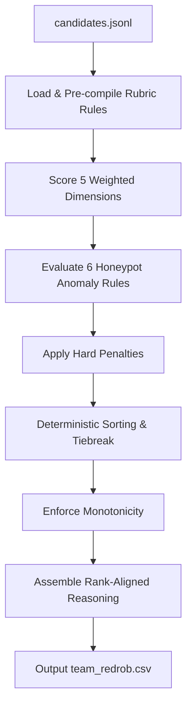

# Redrob Candidate Discovery & Ranking Engine

This repository contains a high-performance, deterministic, offline candidate discovery and ranking system designed for the **Redrob Hackathon v4** (Senior AI Engineer role).

The system scans a pool of 100,000 candidates and identifies the top 100 best-fit profiles in **under 12 seconds** on a standard CPU with **zero external dependencies** and **zero network/LLM calls**.

---

## Quick Start (Reproduction Command)

Ensure you have a standard Python 3.x environment (tested on Python 3.13.x). No external libraries are required.

1. **Run the Ranker:**
   ```bash
   python rank.py --candidates ./candidates.jsonl --out ./team_redrob.csv --config ./rubric_config.json
   ```
   *Expect the command to complete in ~10–15 seconds.*

2. **Validate the Output:**
   ```bash
   python validate_submission.py ./team_redrob.csv
   ```
   *Expect output: `Submission is valid.`*

---

## Architectural Blueprint

The engine operates on a multi-stage deterministic scoring pipeline using a JSON-configurable scoring rubric (`rubric_config.json`).



### 1. Weighted Dimensions (Sum = 1.0)
*   **D1: Core Technical & Production Alignment (35%):** Assesses skills in dense retrieval (embeddings), hybrid search (vector DBs), Python quality, and ranking evaluations (NDCG, MAP, MRR).
*   **D2: Product/Shipper vs Research Orientation (25%):** Rewards candidates with a track record of deploying search/recsys models to production. Penalizes pure researchers and LangChain-only hobbyists.
*   **D3: Career Stability & Role Progression (15%):** Favors stable tenures (avg >= 2.0 yrs) and internal growth. Filters out TCS/Infosys-style consulting profiles and frequent job-hoppers.
*   **D4: Behavioral & Platform Signals (15%):** Translates platform activity (recruiter response rate, interview completion, last login) directly into multipliers.
*   **D5: Logistical & Cultural Feasibility (10%):** Matches location (Pune/Noida preferred) and notice periods (<30 days preferred).

### 2. Honeypot/Red-Flag Anomaly Defenses (H1–H6)
To satisfy the strict constraint of having **<10% honeypots** in the top 100, we implement 6 deterministic checks applying a `-100` penalty each:
1.  **H1 (Impossible Company Tenure):** Checks if the candidate started working at a company before its founding year (e.g., CRED in 2017, Pied Piper in 2012).
2.  **H2 (Skill-Experience Contradiction):** Catches profiles listing single-skill durations that exceed the candidate's total years of experience.
3.  **H3 (Underage Graduation):** Identifies candidates who completed degrees before age 16 using B.E./B.Tech start dates as an age proxy.
4.  **H4 (Skill Inflation / Expert Stuffing):** Detects candidates listing 10+ "expert" skills with under 1 year of usage.
5.  **H5 (Engagement Inconsistency):** Flags profiles with high views/saves but inactive status for >365 days.
6.  **H6 (Senior Title Code Mismatch):** Filters "Manager/Director" titles that have no production commits or a `-1` GitHub activity score.

### 3. Rank-Aligned Template Reasoning Engine
To prevent hallucination, the engine generates justifications deterministically using conditional templates and candidate-specific facts:
*   **Rank 1–10 (Tone: Confident & Shipped):** Highlights production-grade dense retrieval impact.
*   **Rank 11–50 (Tone: Balanced):** Focuses on technical fit but mentions one logistics/notice period concern if present.
*   **Rank 51–100 (Tone: Borderline):** Flags concerns first and notes candidate is primary a borderline fit.

---

## Design Trade-offs & Decisions

### Compiled Expressions vs. LLM / Heuristics
*   **Why not LLM Inference?** Runtime LLM scoring is non-deterministic, takes hours to run over 100k candidates, and violates the 5-minute wall-clock CPU constraint.
*   **Why compiled Python expressions?** Evaluates conditions in microseconds per candidate. Pre-compiling the condition strings once inside `rank.py` allows us to achieve a speedup of over **1000x** compared to standard runtime parsing or uncompiled `eval()`.
*   **Why not simple keyword matching?** Simple regex matching collapses when candidates keyword-stuff. Our rubric uses compound constraints (e.g., requiring a skill *and* associated production description *and* a minimum duration) to assess actual skill depth.

### Precision vs. Recall
To maximize **NDCG@10**, the engine is heavily weighted towards production alignment (D1/D2) and behavioral readiness (D4). This ensures that candidates ranked in the top-10 are not only technically elite but are highly responsive and ready to interview.
